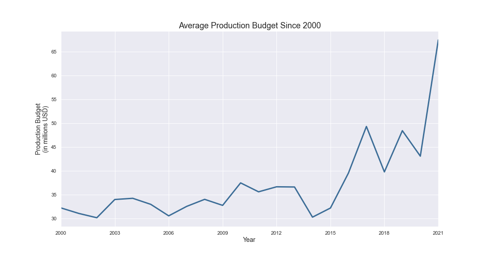
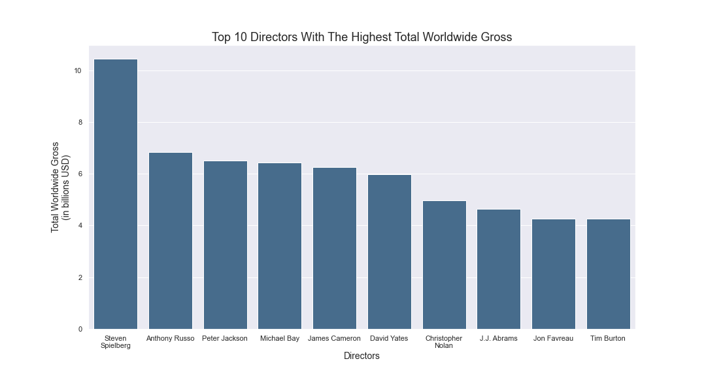

# Microsoft in The Movie Business

**Author**: [Abe Fanta](mailto:afanta@alumni.cmu.edu)

## Overview

This project provides insight on the prospects of Microsoft entering the movie making business. In this competitive market, there are a myriad of factors that need to be addressed before fully committing to the project. First, estimating the budget/expenditure for a successful return on investment needs to be investigated. Investigating whether established franchise for making profits or stand-alone movies is the next step. To avoid possible flops, it is important to see if production budget and viewer satisfaction. Success of movies differs based on the genres. Therefore, genres with easy entry and profitability must be examined. Lastly, casting and director recommendations for a successful franchise is made. Microsoft can use preliminary analysis to venture into movie making or streaming service.

## Business Problem

The movie industry is one of the highest return on investment. However, so far, it has been monopolized by few industries. Streaming industries as now making their own franchises that rivals well established companies. Therefore, it is crucial for new company to examine the key aspects of the industry in order to succeed. This project tends to address the following questions:
- What is the current trend on production budget?
- Are there upsides to establishing a franchise? 
- Do viewers appreciate the production cost of movies? 
- Which genre is the most lucrative?
- Does cast and direction choice influence the gross?


## Data

Data for this project about production budget, domestic and worldwide gross was taken from [The-Numbers](https://www.the-numbers.com/). [IMDb](https://www.imdb.com/) has the largest repository for movies, TVs or virtually any kind of media accessible to the public. [IMDb dataset](https://datasets.imdbws.com/) include the rating, number of votes, release year, genre, cast and crew information. 


## Methods

This project uses raw data comparison and trends with some of the features that can be extracted from the data. This provides some overview on what kind of decisions should be made before getting fully involved in the movie making business. 

## Results

The production cost of movies has appreciated significantly over the last two years. 



Movies that had the highest worldwide gross started as a well-established franchises. There are some break-away cases where stand-alone movies tend to perform better. But the general trend is skewed towards sequels. 


Audience generally favor movies with high production budget even if the quality might not be on par with being a great movie. 


A few specific genres are overall more sellable than others. Animation and adventure movies display this effect. This could also be a reflection to the high production cost that might have been incurred from making such genres. 


Franchises with recognizable roles make movies earn more. This could reflect on audiences' loyalty to the franchise. Another observation is that movies in franchises have nostalgic effect. 


Choice of directors also has a stark impact on how well a movie does. 




## Conclusions

This analysis leads to the following conclusions:

- **New movie franchise requires massive budget, specially since the last couple of years.** While movies generally had upward trend production budget with time, there has been a very noticeable uptick over the last two year. 
- **Sequels are generally favored by audience.** Audience are captivated by sequels to well-established franchises. This remains to be true despite the depreciated quality. Some, however, have been building up their stories to create mass anticipation.   
- **Viewers favorably appreciate the production scale of the project.** Audience and movie goers generally appreciate the effort made to elevate the production budget. This is might seem unsurprising but there are some caveats that could reverse this trend, such as sequels not meeting viewers' expectations.    
- **Some genres (animation, adventure and sci-fi) earn more profit above all others.** Animations have some of the highest grossing. This can reflect two things. First, animations usually have audiences of all ages. Second, animations usually have high overhead cost with rendering farms and with increased technology, attention to details has become increasingly important. 
- **Movies tend to be successful based on the choice of director and cast.** As mentioned, recognizable characters garner more audience than those in a stand-alone movie. Although there were more seasoned actors in the list, those involved in high grossing movies maintained the character throughout the franchise. That could have an influence on how well the movies are received. 


### Next Steps

Further analyses could yield additional insights to make better recommendation for Microsoft:

- **Identify metrics to predict the success rate of movies.** Besides the data that has been presented, there is still more information that could be gathered from the data collected, such as duration of movies to reviews and so on. If more information is needed to predict the success rate of movies, additional data must be collected.  
- **Gather more data on the companies that distribute the movies.** The current dataset suffers from one important metric: which is the name of the distributer. This would further enhance the analysis if streaming services have better success than well-established companies.    
- **Include critics’ reviews.** Up until this point, only onine reviews were gathered. But there are other sources for more curated review such as [Rotten Tomatoes](https://www.rottentomatoes.com/) and other souces that could further enrich the data. 
- **Implement sentiment analysis techniques to gather feedback from reviews.** The next step would be to implement a form of sentiment analysis to automate if review are generally positive, negative or neutral.  

## For More Information

See the full analysis in the [Jupyter Notebook](./Microsoft_movie_business.ipynb) or review this [presentation](./Microsoft_movie_business.pdf).

For additional info, contact Abeselom Fanta at [afanta@alumni.cmu.edu](mailto:afanta@alumni.cmu.edu)


## Repository Structure

```
├── code
│   ├── the_numbers_scraper.ipynb
│   ├── imdb_dataset_download.ipynb
│   ├── consolidate_scraped_data.ipynb
│   └── visualization.ipynb
├── data
├── images
├── zippedData
├── README.md
├── Microsoft_movie_business.pdf
└── Microsoft_movie_business.ipynb
```
